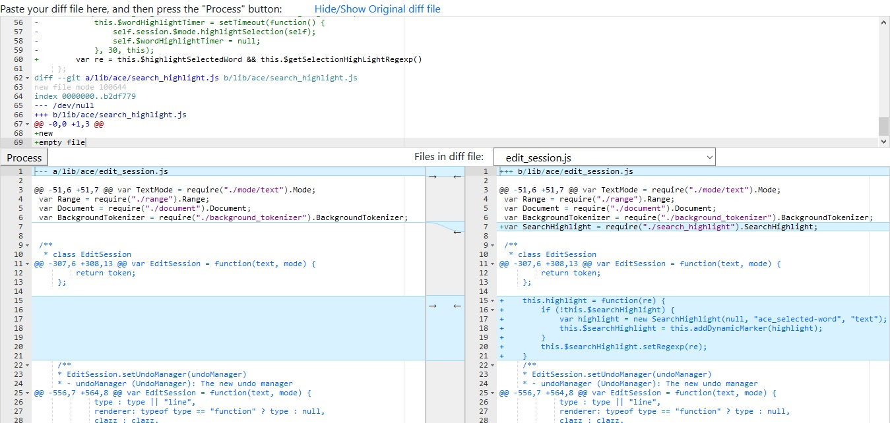

# DIFF VIEWER

DiffViewer is a simple html and js program to visualize diff files, side by side to easily compare differences among the each of the files included in the diff.

It is executed completely in the browser, no server side processing at all, it is pretty quick and should have no problems with big diff files.

## Instructions

The usage is really simple, just paste the diff contents in the first textbox, and click on the process button and the diff will appear side by side on the two lower panes. You can check it out [here](https://tritium.cl/diff-viewer/diffviewer.html)

If the diff contains differences of many files, these files will be shown in the dropdown for you to view individually:

## Components used
DiffViewer is built on top of [Ace Editor](https://ace.c9.io/), [ace-diff](https://github.com/ace-diff/ace-diff/), [vuejs](https://vuejs.org) and [bootstrap](https://getbootstrap.com/)